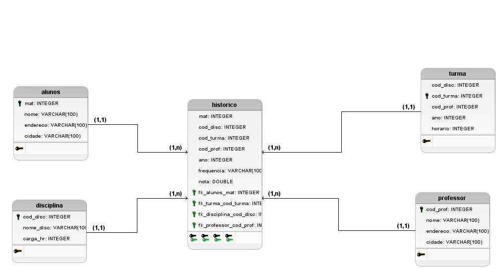

# Modelagem do banco de dados 
<b>Prova banco de dados</b>

# Descrição das tabelas e explicação das mesmas

<h2>Tabela histórico</h2>
A tabela <b>histórico</b> é a responsável por armazenar as informações de alunos, disciplina, turma e professor. Ela é a relação de todos, e é responsável por armazenar os dados e os atributos que vamos guardar no banco. 
Nela possuímos quatro chaves estrangeiras e elas são:
<ul>
 <li>fk_alunos_mat: chave estrangeira que faz referência a tabela <b>aluno</b>;</li>
 <li>fk_turma_cod_turma: chave estrangeira que faz referência a tabela <b>turma</b>;</li>
 <li>fk_disciplina_cod_disciplina: chave estrangeira que faz referência a tabela <b>disciplina</b>;</li>
 <li>fk_professor_cod_professor: chave estrangeira que faz referência a tabela <b>professor</b>.</li>
</ul>
Já os atributos/colunas são:
<ul>
<li>mat: matrícula do aluno</li>
<li>cod_disc: código de registro da disciplina;</li>
<li>cod_turma: código de registro da turma;</li>
<li>cod_prof: código de registro do professor;</li>
<li>ano: ano da turma;</li>
<li>frequência: frequência da turma;</li>
<li>nota: nota dos alunos.</li>
</ul>

<h2>Tabela alunos</h2>

A tabela <b>aluno</b> será na nossa base de dados a responsável por manter os dados dos alunos do sistema.
Nela possuímos uma chave primária e três atributos/colunas:
<ul>
<li>mat: chave primária que faz referência a matrícula do aluno;</li>
<li>nome: nome do aluno;</li>
<li>endereço: endereço onde está localizado o aluno;</li>
<li>cidade: cidade onde reside o aluno.</li>
</ul>

<h2>Tabela disciplina</h2>

Tabela <b>disciplina</b>, teremos aqui as informações sobre as disciplinas que estão sendo lecionadas. Nela teremos uma chave primária e dois atributos/colunas:
<ul>
<li>cod_disc: chave primária que faz referência ao código de registro da disciplina;</li>
<li>nome: nome da disciplina;</li>
<li>carga_hr: carga horária da disciplina.</li>
</ul>

<h2>Tabela turma</h2>

Tabela <b>turma</b>, a tabela turma irá conter as informações sobre a turma. Nela temos uma chave primária e quatro atributos/colunas:
<ul>
<li>cod_disc: que vai ser o código de registro da disciplina que vai estar sendo lencionada na turma;</li>
<li>cod_turma: chave primária que faz referência ao código de registro da turma;</li>
<li>cod_prof: que vai ser o código de registro do professor que ensina naquela turma;</li>
<li>ano: ano da turma;</li>
<li>horário: seu respectivo horário entrada, intervalo e saída.</li>
</ul>

<h2>Tabela professor</h2>

A tabela do <b>professor</b> é a tabela que conterá os dados do professor. Nela temos uma chave primária e três atributos/colunas:
<ul>
<li>cod_prof: código de registro do professor;</li>
<li>nome: nome do professor;</li>
<li>endereço: endereço onde está localizado o professor;</li>
<li>cidade: cidade onde reside o professor.</li>
</ul>
